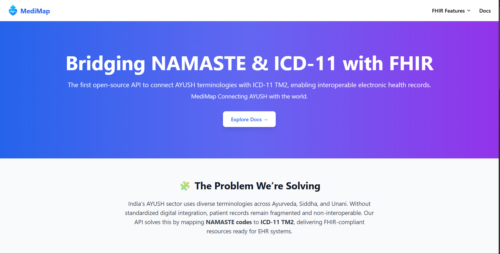

# **FHIR Bundle Form Demo**

This project is a **Next.js + Fuse.js demo** for generating a valid [FHIR](https://hl7.org/fhir/bundle.html) **Bundle** resource.
It allows users to fill in **Patient, Encounter, and Condition** details, search diseases using **NAMASTE → ICD-11 mapping**, and instantly preview the generated JSON.

---

### **Features**

- Patient, Encounter, and Condition input forms
- Disease search powered by [Fuse.js](https://fusejs.io/) (fuzzy search)
- Dual coding support (**NAMASTE + ICD-11**)
- Live JSON preview of generated **FHIR Bundle**
- Fully responsive with Tailwind CSS
- Styled with `blue-600` as the primary theme

---

### **Screenshot**



---

## **Tech Stack**

- [Next.js](https://nextjs.org/) (App Router, React 18)
- [Tailwind CSS](https://tailwindcss.com/) (responsive UI)
- [Fuse.js](https://fusejs.io/) (fast fuzzy search)
- JSON Terminology file (`namaste_icd.json`)

---

## **Project Structure**

```
/app
  /page.tsx        → Entry page
  /components
    /BundleForm.tsx → Main form component
/data
  /namaste_icd.json → Terminology mapping (NAMASTE ↔ ICD-11)
```

---

## **Getting Started**

Clone this repo:

```bash
git clone https://github.com/YOUR-USERNAME/fhir-bundle-form.git
cd fhir-bundle-form
```

Install dependencies:

```bash
npm install
# or
yarn install
```

Run development server:

```bash
npm run dev
```

Then open [https://namaste-prototype.vercel.app/](https://namaste-prototype.vercel.app/)

---

## **Example FHIR Bundle Output**

```json
{
  "resourceType": "Bundle",
  "id": "bundle-example-1",
  "type": "collection",
  "entry": [
    {
      "fullUrl": "urn:uuid:patient-001",
      "resource": {
        "resourceType": "Patient",
        "id": "patient-001",
        "name": [
          {
            "use": "official",
            "family": "Sharma",
            "given": ["Rahul"]
          }
        ],
        "gender": "male",
        "birthDate": "1985-06-15"
      }
    },
    {
      "fullUrl": "urn:uuid:encounter-001",
      "resource": {
        "resourceType": "Encounter",
        "id": "encounter-001",
        "status": "finished",
        "class": {
          "system": "http://terminology.hl7.org/CodeSystem/v3-ActCode",
          "code": "AMB",
          "display": "ambulatory"
        },
        "subject": { "reference": "Patient/patient-001" }
      }
    },
    {
      "fullUrl": "urn:uuid:condition-001",
      "resource": {
        "resourceType": "Condition",
        "id": "condition-001",
        "clinicalStatus": {
          "coding": [
            {
              "system": "http://terminology.hl7.org/CodeSystem/condition-clinical",
              "code": "active"
            }
          ]
        },
        "code": {
          "coding": [
            {
              "system": "http://example.org/fhir/CodeSystem/namaste",
              "code": "NAM001",
              "display": "Amlapitta (Hyperacidity)"
            },
            {
              "system": "http://id.who.int/icd/entity",
              "code": "1683919439",
              "display": "Gastritis"
            }
          ]
        },
        "subject": { "reference": "Patient/patient-001" },
        "encounter": { "reference": "Encounter/encounter-001" }
      }
    }
  ]
}
```

---

## **Next Steps**

- Add **Copy JSON** button
- Connect to a real **FHIR server** for validation
- Extend with **Observation, Medication, Procedure** resources

---

## **License**

MIT License © 2025 \[FHIR VALIDATOR]
